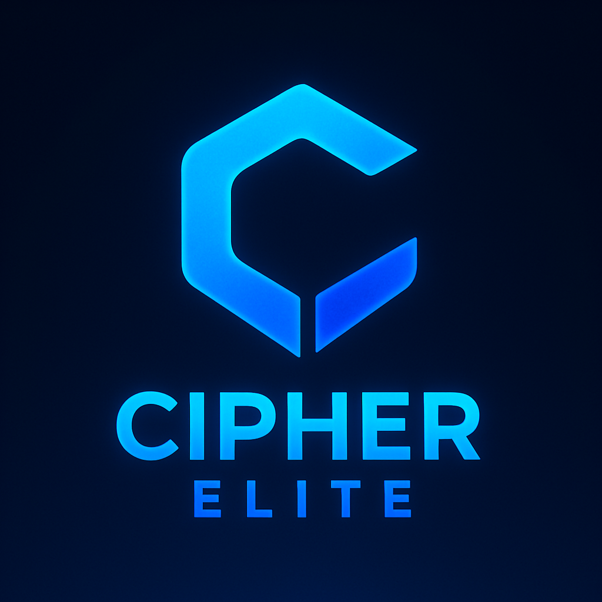

# 匚ɪᴘԋᴇʀ Ξʟɪᴛᴇ USERBOT

> 🛑 **STOP PAYING FOR HOSTING!**
> **CipherElite comes with FREE 24/7 HOSTING via our exclusive bot.**
> No Credit Card. No VPS needed. [Deploy in 30 seconds](#-deployment).

<p align="center">
  
</p>

<p align="center">
  
</p>

<p align="center">
    <a href="https://github.com/rishabhops/CipherElite/stargazers"></a>
    <a href="https://github.com/rishabhops/CipherElite/network/members"></a>
    <a href="https://github.com/rishabhops/CipherElite/issues"></a>
    <a href="https://github.com/rishabhops/CipherElite/blob/elite/LICENSE"></a>
</p>

<p align="center">
    <b>The Smartest, Most Secure Telegram Userbot (2026)</b>
</p>

---

## 📑 TABLE OF CONTENTS
- [About](#-about)
- [Why Cipher Elite?](#-features)
- [Deployment](#-deployment)
- [Configuration](#-configuration-vars)
- [Support & Community](#-support--updates)
- [Credits](#-credits)

---

## 📖 ABOUT

**CipherElite** isn't just another userbot—it is a **Self-Healing Automation Suite**.

Built on **Telethon** by **Rishabh Anand**, it solves the biggest problems in Telegram automation:
1.  **Security:** Our proprietary `ELITE_SESSION` prevents hackers from stealing your account.
2.  **Stability:** Our **Smart Plugin Manager** auto-detects and installs missing dependencies (`pip install`) so your bot never crashes.
3.  **Accessibility:** We provide **Free Hosting** so anyone can use it.

### 🛠 Tech Stack


---

## ⚡ FEATURES

| Feature | Description |
| :--- | :--- |
| **🧠 Smart Plugin Manager** | **(Exclusive)** Auto-scans plugin code, installs missing libraries/requirements instantly. Zero crashes. |
| **🛡️ Anti-Hack Session** | Uses `ELITE_SESSION` encryption. If a hacker steals your string, they **cannot** use it on other tools. |
| **🤖 Native AI** | Integrated AI commands for auto-replies, summaries, and chat assistance. |
| **⚡ Free Hosting** | We provide a dedicated Deployer Bot that hosts your userbot for free (24/7). |
| **🎭 Native Fun Plugins** | Custom-written Games, Animations, and 'Magic' commands with **Zero Lag**. |
| **🔄 Safe Updates** | Update your bot without losing your `vars` or configuration. |
| **📊 Analytics** | Built-in performance monitoring and ping checks. |

---

## 🚀 DEPLOYMENT

### 🎥 Watch: How to Deploy in 60 Seconds (Free)

<div align="center">
  <a href="https://www.youtube.com/watch?v=XBHyZyJcv5c">
    
  </a>
  <br>
  <b>▶️ Click here to watch the Tutorial</b>
</div>

<br>

### 📲 Method 1: Telegram Deployer (Recommended)
**No coding required. No Credit Card.**

1.  **Fork this Repository:**
    * Click the `Fork` button (top right).
    * *Critical:* You must use your forked link.

2.  **Get Your Session:**
    * Start [@elite_session_maker_bot](https://t.me/elite_session_maker_bot).
    * Follow steps to generate your `ELITE_SESSION`.

3.  **Deploy:**
    * Go to **[@elitedeployerbot](https://t.me/elitedeployerbot)**.
    * Send the link to **your forked repository**.
    * Enter variables when prompted.

> **✅ Why use Elite Deployer?**
> * Free 24/7 Hosting
> * Live Logs Dashboard
> * Instant Restart/Variable Editing

---

### 💻 Method 2: VPS / Terminal (Manual)
If you prefer full control (Termux/Ubuntu/Debian), use `tmux` to keep the bot running 24/7.

```bash
# 1. Update System & Install Dependencies (including tmux)
sudo apt update && sudo apt upgrade -y
sudo apt install python3-pip git tmux -y

# 2. Clone the Repository
git clone https://github.com/rishabhops/CipherElite
cd CipherElite

# 3. Setup Configuration
# Copy the sample env file to a real .env file
cp sample.env .env

# Edit the file to add your API_ID, HASH, and SESSION
nano .env
# (Press Ctrl+O to save, Enter to confirm, Ctrl+X to exit)

# 4. Install Python Requirements
pip3 install -r requirements.txt

# 5. Run 24/7 using Tmux
tmux new -s cipher
python3 main.py

# To check your bot later, type tmux attach -t cipher in your terminal.
# To exit the logs without stopping the bot, press Ctrl+B then D.
```

---

## ⚙️ CONFIGURATION VARS

| Variable | Description |
|---|---|
| `API_ID` | Get from my.telegram.org |
| `API_HASH` | Get from my.telegram.org |
| `ELITE_SESSION` | Required. Get from @elite_session_maker_bot |
| `LOG_CHAT_ID` | Private Channel ID for Logs |
| `SUDO_USERS` | Your User ID (for admin control) |

🛡️ **SECURITY NOTICE:**
> Cipher Elite uses a Locked Session Protocol. Standard StringSessions (from any other bots) will NOT work.
> This creates a security layer: Even if your session file is stolen, generic session stealers cannot access your account.

---

## 💫 SUPPORT & UPDATES

Join our growing community for plugins, help, and updates.
<p align="center">
<a href="https://t.me/THANOS_PRO"></a>
<a href="https://t.me/thanosprosss"></a>
</p>

---

## 🌟 CREDITS & OWNER

<p align="center">

</p>
<h3 align="center">Rishabh Anand</h3>
<p align="center">
<b>Lead Developer & Founder of Thanos Pro Organization</b>
</p>
<p align="center">
<a href="https://t.me/thanosceo"></a>
<a href="https://github.com/rishabhops"></a>
</p>

### **Acknowledgments:**
* **Telethon:** For the foundational library.
* **Open Source Community:** For the continuous inspiration.

---

## ⚖️ DISCLAIMER

> This userbot is an open-source educational project. The developers (Rishabh Anand & Thanos Pro Org) are not responsible for any account bans or restrictions caused by improper usage of this tool.

---

<p align="center">
<b>Enjoying Cipher Elite? Please drop a ⭐ Star on the repository!</b>
</p>
